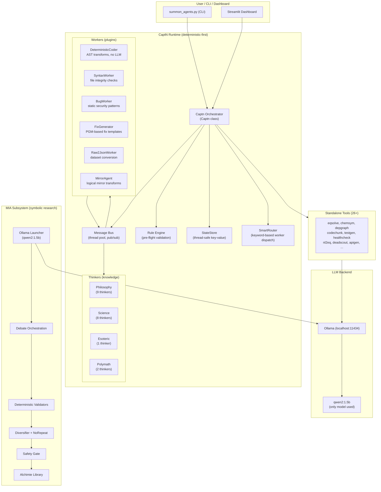
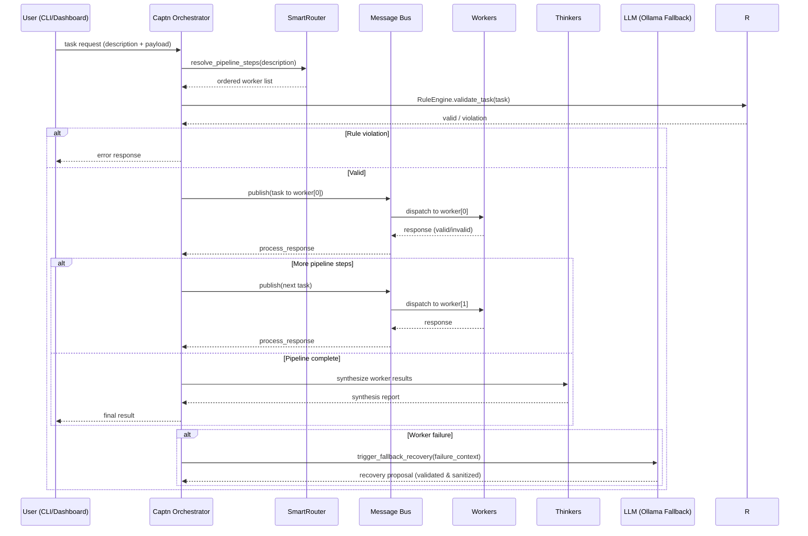

# Architecture Overview

CaptN-BRAIN is designed as a **deterministic-first, multi-agent runtime** with a clear separation between an **Orchestrator (the Brain)** and **Workers (the Hands)**, connected via an internal **Message Bus**.

---

## High-Level Architecture



---

## Core Components

### 1. Captn Runtime (`captn/runtime/`)

The deterministic agent runtime. Provides the orchestrator, message bus, plugin system, state management, rule engine, and LLM provider abstraction.

**Key files:**

| File | Component | Role |
|------|-----------|------|
| `runtime.py` | `Captn`, `MessageBus`, `StateStore`, `RuleEngine` | Orchestrator core |
| `base.py` | `Message`, `Task`, `Rule`, `Pipeline`, `Plugin` | Data types & base class |
| `manager.py` | `PluginManager` | Plugin registry & lifecycle |
| `llm_provider.py` | `OpenAIProvider`, `FallbackLLM` | LLM abstraction & recovery |
| `llm_host.py` | `ollama_base_url()` | Resolve Ollama host (host vs container) |
| `mirror_agent.py` | `MirrorAgent` | Logical mirror transformations |
| `mirror_rules.py` | `MirrorRules` | Configurable mirror & experimental rules |
| `thinker.py` | `Thinker` | Synthesis of worker findings |
| `validator.py` | `PatchValidator` | AST-based patch safety validation |
| `workers.py` | `SyntaxWorker`, `BugWorker` | Built-in analysis workers |
| `schemas.py` | `UniversalData`, `AgentTask`, `AgentResponse` | Data contracts |

### 2. Message Bus (`MessageBus`)

Threaded pub/sub message queue connecting all components.

- `Message` is the universal communication unit (sender, destination, type, payload, timestamp)
- `subscribe(destination, callback)` — register handlers
- `publish(message)` — dispatch to all subscribers of `message.destination`
- Uses a `ThreadPoolExecutor` (max 8 workers) for concurrent dispatch
- Bus runs in its own thread (`bus.run()`)

### 3. StateStore

Thread-safe key-value store for task state, with snapshot/rollback support for safe patch operations.

- `update(task_id, data)`, `get(task_id)`, `append(task_id, key, item)`
- `create_snapshot(task_id, file_paths)` — captures file state before applying changes
- `rollback(task_id)` — atomically restores files from snapshot

### 4. SmartRouter (`captn/workers/orchestration/smart_router.py`)

**The heart of deterministic routing.** Maps natural-language task descriptions to the best worker(s) using:

- **Explicit keyword table** (`WORKER_ROUTES`) — 110+ keyword-to-worker mappings
- **Keyword overlap scoring** between description and worker capabilities
- **Fairness boost** — underutilized workers get a score bonus
- **Opposition mode** — selects workers from deliberately contrasting domains
- **Round-robin rotation** within equal-score groups

No LLM is used for routing — it is pure keyword scoring.

### 5. DeterministicCoder (`captn/workers/code_generation/deterministic_coder.py`)

A **100% deterministic code transformation worker** that never calls an LLM. Provides three AST passes:

| Pass | What it does |
|------|-------------|
| `docstrings` | Adds missing module/class/function docstrings |
| `annotate` | Adds conservative type annotations from literal defaults |
| `normalize` | Re-formats via `ast.unparse` (stable, reproducible) |

**Safety gates applied before writing:**
- `PatchValidator` — blocks destructive operations and core-file writes
- `behaviorally_equivalent()` — structural AST comparison guarantees transforms never change program behavior

### 6. Thinkers (`captn/thinkers/`)

20 deterministic knowledge workers organized by domain. Each loads a corpus text file and parses numbered entries into structured findings — **pure regex, no LLM.**

| Domain | Thinkers | Corpus |
|--------|----------|--------|
| Philosophy (9) | Aristotle, Plato, Socrates, Confucius, Descartes, Kant, Nietzsche, Locke, Philosophers aggregate | `captn/thinkers/philosophy/*.txt` |
| Science (8) | Einstein, Newton, Curie, Pythagoras, Mathematicians, Physicists, Chemists, Scientists aggregate | `captn/thinkers/science/*.txt` |
| Esoteric (1) | Alchimie | `captn/thinkers/esoteric/*.txt` |
| Polymath (2) | Da Vinci, Turing | `captn/thinkers/polymath/*.txt` |

### 7. MIA Subsystem (`mia/`)

Multi-Agent Intelligence Alchemy — a symbolic research framework for equation generation, debate, validation, mutation, and archiving.

**Key components:**

| File | Role |
|------|------|
| `launcher_ollama.py` | Main orchestration loop (variable discovery → equation synthesis → validation → diversification → safety → archive) |
| `config.py` | `RuntimeConfig` — all agent models pinned to `qwen2:1.5b` |
| `ollama_client.py` | Ollama REST client with retry, truncation detection, and security guards |
| `variable_debate_orchestrator.py` | Multi-agent variable discovery through debate |
| `equation_debate_orchestrator.py` | Equation synthesis through adversarial debate |
| `diversifier_worker.py` | Structural mutation of equations (no LLM) |
| `no_repetition_worker.py` | Session-wide anti-duplication registry |
| `library_safety_gate.py` | Safety testing before archiving |
| `shared_memory.py` | Cross-cycle shared research memory |
| `workspace_security.py` | Path validation and workspace management |

---

## Request Execution Flow



---

## Decision Flow for LLM Usage

```text
Request enters the system
│
├── Can deterministic logic solve it?
│   ├── Yes → Process with deterministic tool/worker
│   │         Zero tokens consumed. Millisecond latency.
│   │         Deterministic output.
│   └── No
│
├── Is there a deterministic worker registered for this task?
│   ├── Yes (SmartRouter scores > 0) → Route to the best worker
│   └── No
│
├── Is local LLM available (Ollama)?
│   ├── Yes → Use qwen2:1.5b (local, private, no API key)
│   └── No / Failed
│
└── Fallback path:
    ├── OpenAIProvider (if API key configured)
    │   └── Only for recovery proposals, never for normal processing
    └── If all fail → graceful error
```

---

## Configuration System

Configuration is managed through:

1. **`.env` file** (gitignored) — dashboard auth, optional GitHub/OpenAI tokens
2. **`mia/config.py`** — `RuntimeConfig` dataclass with over 30 parameters
3. **Environment variables** — `OLLAMA_HOST`, `LM_STUDIO_HOST`, `IN_CONTAINER`, `OPENAI_API_KEY`, `OPENAI_BASE_URL`, `CAPTN_AUTH_PASSPHRASE`

Key configuration parameters in `RuntimeConfig`:

```python
llm_as_fallback: bool = True         # LLM only as last resort
llm_enabled: bool = False            # FULL deterministic mode (default)
api_url: str = "http://localhost:11434/api/chat"
model_aurelius: str = "qwen2:1.5b"  # ALL agents use the same model
```